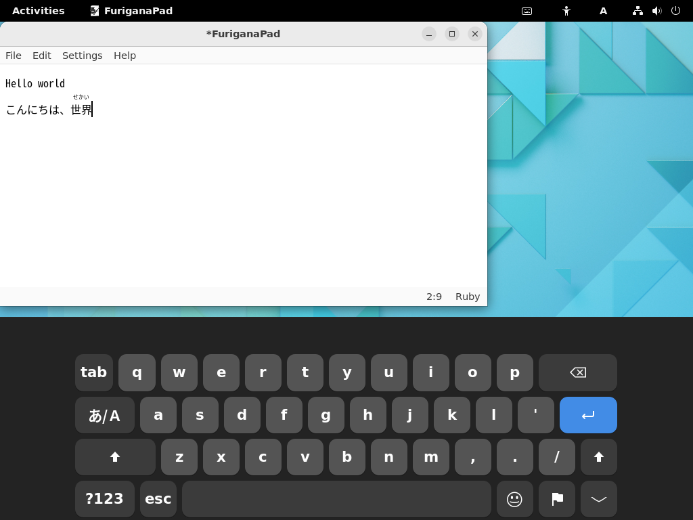
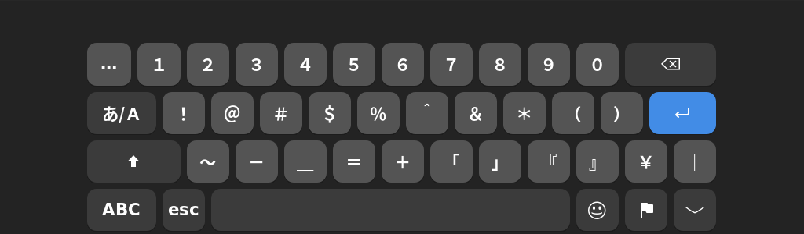

# On-Screen Keyboard improved for Input Methods

*On-Screen Keyboard improved for Input Methods* (OSKIM) is a [GNOME Shell extension](https://gjs.guide/extensions/). It extends [GNOME On-Screen Keyboard](https://help.gnome.org/users/gnome-help/stable/keyboard-osk.html) (OSK).
OSKIM contains a mechanism to provide dedicated on-screen keyboard layers for each Input Method Engine (IME). Currently, OSKIM supports Japanese [Hiragana IME for IBus](https://github.com/esrille/ibus-hiragana).

OSKIM has been tested with GNOME 42.5 on Ubuntu 22.04 LTS. We will support newer versions of GNOME Shell in the future.

## Installation

Clone this repository under the GNOME shell extensions directory as below:

```
$ git clone https://github.com/esrille/oskim.git ~/.local/share/gnome-shell/extensions/oskim@esrille.com
```

Enable OSKIM by running the following command:

```
$ gnome-extensions enable oskim@esrille.com
```

If you prefer GUI tools, you could use [Extension Manager](https://github.com/mjakeman/extension-manager).

## On-Screen Keyboard Layers for Hiragana IME

*OSKIM supports [Hiragana IME for IBus](https://github.com/esrille/ibus-hiragana) v0.15.0 or later.*

OSKIM provides multiple on-screen keyboard layers for Hiragana IME. The active on-screen keyboard layer is synchronized with the current input mode of the Hiragana IME.

### Alphanumeric mode (A)




### Hiragana mode (あ) for Kana typing




### Hiragana mode (あ) for Rōmaji typing


