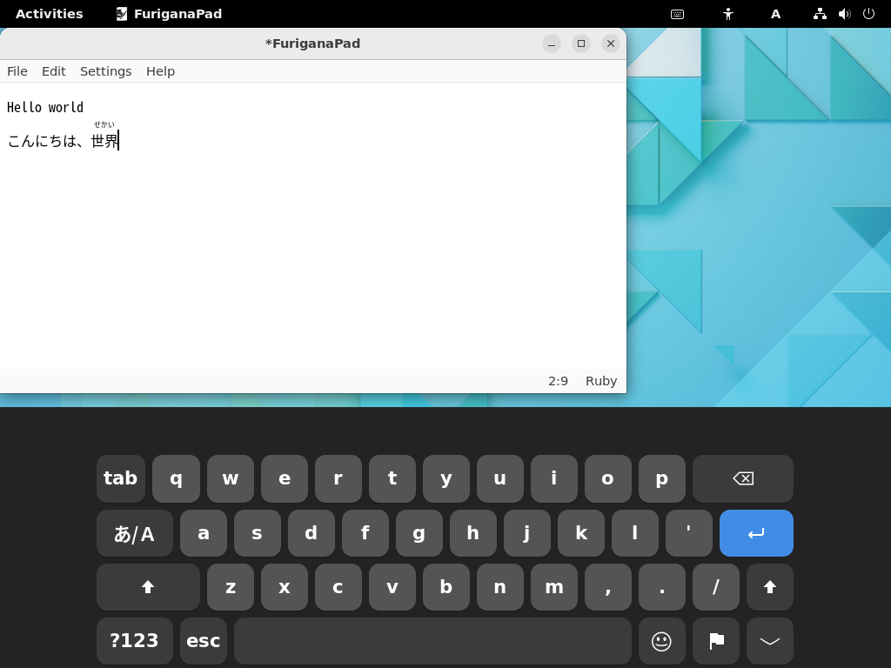
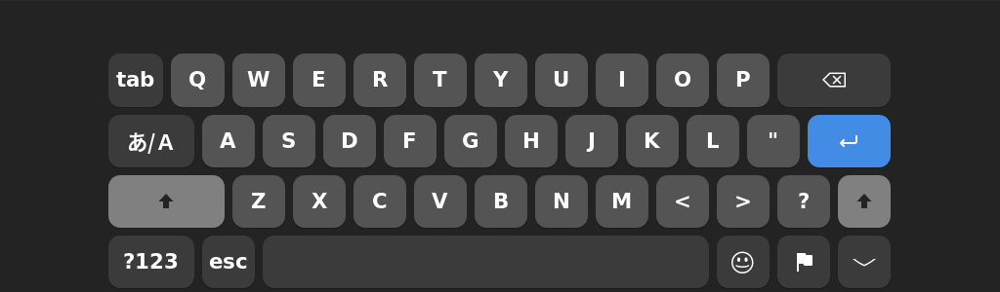
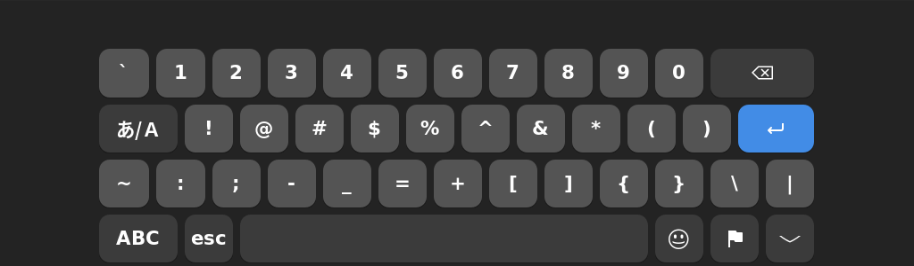
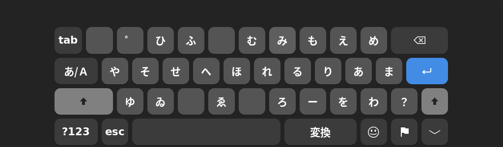
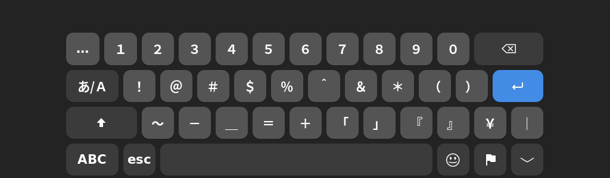
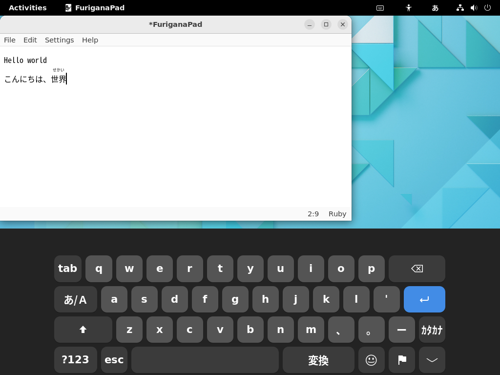
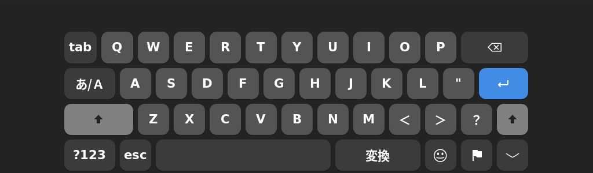

# つかいかた（ひらがなIMEのとき）

※ OSKIMは「[ひらがなIME](https://github.com/esrille/ibus-hiragana)」 v0.15.0 以降いこうをサポートしています。

 　入力にゅうりょくソースをひらがなIMEにしておくと、OSKIMはひらがなIME用ようのオンスクリーン キーボードを表示ひょうじします。
ひらがなIMEの設定せっていや入力にゅうりょくモードによって、画面がめんに表示ひょうじされるオンスクリーン キーボードも自動的じどうてきにきりかわります。

## 英数えいすうモード (A)

　入力にゅうりょくモードが「英数えいすう」のとき、オンスクリーン キーボードはQWERTY配列はいれつで表示ひょうじされます。
つかいかたはデフォルトのオンスクリーン キーボードとかわりありません。
ひらがなIMEの入力にゅうりょくモードをきりかえたいときは、あ/Aボタンをタップします。

## ひらがなモード (あ) ／ かな入力にゅうりょく

　ひらがなIMEの文字もじの打うちかたを「かな(ニュー スティックニー配列はいれつ)」にしていると、入力にゅうりょくモードが「ひらがな」のとき、オンスクリーン キーボードもニュー スティックニー配列はいれつで表示ひょうじされます。
　スペースキーのボタンをタップすると、つぎにシフトがわの文字もじを１文字もじ入力にゅうりょくすることができます。
シフトがわの文字もじを連続れんぞくして入力にゅうりょくしたいときは、⇧ボタンをタップすれば、オンスクリーン キーボードをシフトがわにロックできます。

## ひらがなモード(あ) ／ ローマ字じ入力にゅうりょく

　ひらがなIMEの文字もじの打うちかたを「ローマ字じ」にしていると、入力にゅうりょくモードが「ひらがな」のとき、オンスクリーン キーボードはQWERTY配列はいれつで表示ひょうじされます。長音ちょうおん記号きごう用ようのーボタンは、。ボタンのみぎとなりにあります。

